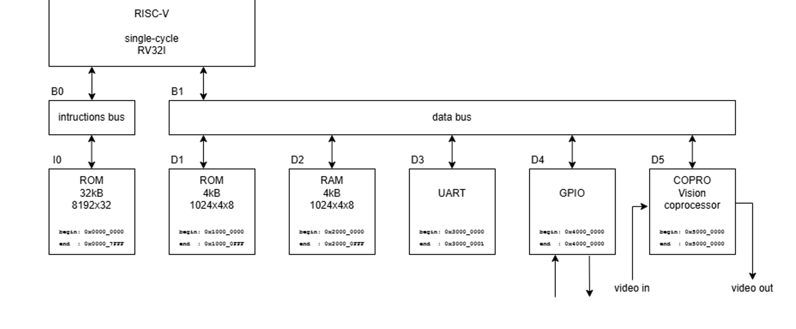
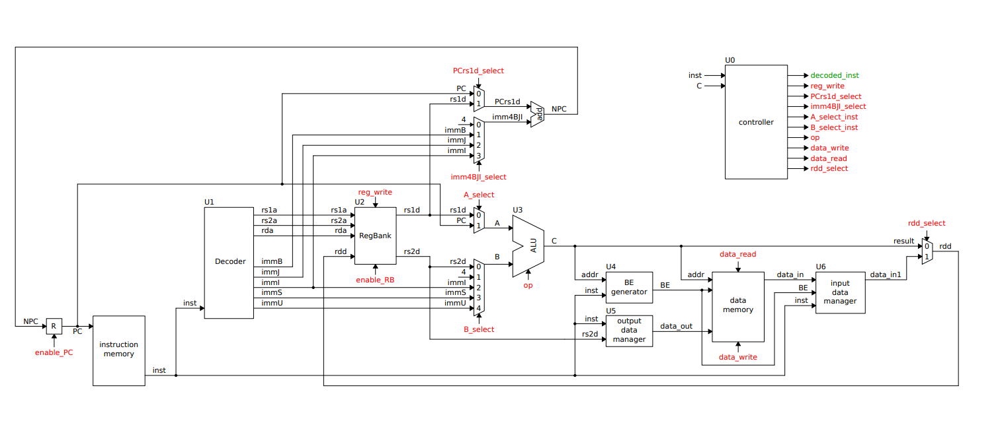

# RISC-V SoC with UART

[](https://www.xilinx.com/products/design-tools/vivado.html)
[](https://riscv.org/)
[](https://en.wikipedia.org/wiki/VHDL)

A complete System-on-Chip (SoC) implementation featuring a RISC-V 32-bit processor with UART communication, GPIO, memory management, and a coprocessor. Designed for FPGA deployment with full AXI-4 Lite bus integration.

## Table of Contents

- [Features](#features)
- [Project Overview](#project-overview)
- [Architecture](#architecture)
- [Directory Structure](#directory-structure)
- [VHDL Components](#vhdl-components)
- [AXI Bus Interface](#axi-bus-interface)
- [Test Programs](#test-programs)
- [Simulation](#simulation)
- [Building and Deployment](#building-and-deployment)
- [File Descriptions](#file-descriptions)
- [Configuration](#configuration)
- [Performance Characteristics](#performance-characteristics)
- [Troubleshooting](#troubleshooting)
- [License](#license)

## Features

- ✅ **RISC-V RV32I ISA**: Full 32-bit instruction set support
- ✅ **Multi-cycle Architecture**: FSM-based control for deterministic execution
- ✅ **AXI-4 Lite Integration**: Industry-standard interconnect protocol
- ✅ **Dual Memory Bus**: Separate instruction and data pathways
- ✅ **Serial Communication**: UART interface for debug/control
- ✅ **GPIO Controller**: Programmable I/O with AXI interface
- ✅ **Auxiliary Coprocessor**: Extended computation capabilities
- ✅ **Simulation Ready**: Integrated ModelSim testbenches
- ✅ **FPGA Optimized**: Designed for Xilinx FPGA deployment

## Project Overview

This project implements a complete RISC-V based SoC in VHDL, integrating multiple components:

- **RISC-V 32-bit CPU**: RV32I instruction set implementation with single-cycle execution
- **UART Interface**: Serial communication module for external connectivity
- **GPIO Controller**: General purpose input/output with programmable control
- **Memory Subsystem**: Dual-port RAM and ROM with AXI-4 Lite interfaces
- **Coprocessor**: Auxiliary computation unit for specialized operations
- **AXI Interconnect**: Central bus connecting all components

## Architecture

### System Architecture



### RISC-V Single-Cycle Processor Architecture



### Instruction Execution Flow

All instructions execute in a single clock cycle:

1. **Fetch & Decode**: Instruction fetched and decoded simultaneously
2. **Execute**: ALU computes results or addresses in parallel
3. **Memory Access**: For LOAD/STORE operations, completed within same cycle
4. **Write-Back**: Results stored to register file
5. **Next Cycle**: PC incremented, ready for next instruction with CPI = 1

## Directory Structure

```
RiscV_uart/
├── vhdl/                         # VHDL source files
│   ├── riscv/                   # RISC-V CPU implementation
│   │   ├── RISCV32I_core_axi.vhd
│   │   ├── ALU.vhd
│   │   ├── controller.vhd
│   │   ├── decoder.vhd
│   │   ├── ...
│   │   └── pack_RISCV32I_*.vhd
│   ├── uart/                    # UART controller module
│   ├── gpio/                    # GPIO module
│   ├── memory/                  # RAM and ROM modules
│   ├── copro/                   # Coprocessor module
│   └── soc/                     # Top-level SoC integration
├── prog/                        # Test programs
│   ├── prog_asm_0/             # Assembly program examples
│   ├── prog_asm_1/
│   ├── prog_asm_2/
│   ├── prog_asm_3/
│   ├── prog_c_0/               # C program examples
│   └── prog_c_1/
├── modelsim/                    # ModelSim simulation files
│   ├── sim_system.do           # Simulation script
│   ├── wave_system.do          # Waveform configuration
│   ├── transcript              # Simulation log
│   └── [component]/            # Compiled libraries
├── vivado2/                     # Vivado project
│   ├── vivado.xpr             # Project file
│   ├── vivado.srcs/           # Source files
│   ├── vivado.sim/            # Simulation configuration
│   └── vivado.runs/           # Build artifacts
├── outils_compilation_xpack.txt # xPack toolchain installation guide (French)
├── pins.xdc                    # FPGA pin constraints
├── commandes_vivado.txt        # Vivado TCL commands
└── README.md                   # This file
```

## VHDL Components

### RISC-V CPU (vhdl/riscv/)

**Single-cycle processor architecture**

- 32-bit instruction and data paths
- RV32I instruction set support
- Single-cycle execution - all instructions complete in one clock cycle
- Separate instruction and data bus phases via AXI-4 Lite
- Arithmetic Logic Unit (ALU) with standard operations
- Instruction decoder for RV32I decoding
- 32 general-purpose registers (x0-x31)
- Program counter with configurable start address

**Key Features:**
- Single-cycle per instruction (CPI = 1)
- Support for all RV32I instruction types (R, I, S, B, U, J)
- Parallel execution paths optimized for speed
- Integrated control path for instruction execution

### UART (vhdl/uart/)

**Serial communication interface**

- Configurable baud rate
- AXI-4 Lite slave interface
- Full-duplex communication
- TX and RX buffers
- Programmable data width

### GPIO (vhdl/gpio/)

**General-purpose I/O controller**

- Programmable I/O pins
- AXI-4 Lite slave interface
- Input and output control registers
- Direction configuration per pin

### Memory (vhdl/memory/)

**Hierarchical memory subsystem**

- **RAM**: Dual-port (2PN×4 architecture)
  - Separate read and write ports
  - Configurable depth and width
  - AXI-4 Lite slave interface
  
- **ROM**: Read-only boot memory
  - Pre-loaded with boot code
  - AXI-4 Lite slave interface
  - Used for program initialization

### Coprocessor (vhdl/copro/)

**Auxiliary computation unit**

- Specialized operation support
- AXI-4 Lite slave interface
- Extended instruction processing capabilities

## AXI Bus Interface

All components communicate via **AXI-4 Lite** protocol:

### Instruction Bus (From CPU)
- **AR Channel**: Address Read Request (address, valid, ready)
- **R Channel**: Read Data Response (data, valid, ready)

### Data Bus (From CPU)
- **AW Channel**: Address Write Request
- **W Channel**: Write Data with byte enables
- **B Channel**: Write Response

**Protocol Characteristics:**
- Clock-driven synchronous interface
- Ready/Valid handshaking
- Byte enable support for partial writes
- Response codes for transaction status

## Test Programs

### Assembly Programs (prog/prog_asm_*)

Test programs written in RISC-V assembly:

- **prog_asm_0**: Basic instruction validation
- **prog_asm_1**: Memory operations and looping
- **prog_asm_2**: Control flow (branches, jumps)
- **prog_asm_3**: Complex instruction sequences

**Build:**
```bash
cd prog/prog_asm_0
compile.bat
```

Output files:
- `prog.s` - Assembly source
- `prog.dis` - Disassembly listing
- `I0.mem` - Instruction memory image
- `D1.mem` - Data memory image

### C Programs (prog/prog_c_*)

Test programs written in C:

- **prog_c_0**: Basic C functionality
- **prog_c_1**: Advanced C features

**Build:**
```bash
cd prog/prog_c_0
compile.bat
```

**Files:**
- `main.c` - C source code
- `system.h` - Hardware definitions
- `crt0.S` - C runtime startup
- `link3.ld` - Linker script
- Memory images (I0.mem, D1.mem)

## Simulation

### QuestaSim Setup

The project includes complete QuestaSim simulation (also compatible with ModelSim):

- **sim_system.do**: Main simulation script
  - Library compilation order
  - Testbench instantiation
  - Simulation timing configuration

- **wave_system.do**: Waveform viewer configuration
  - Signal grouping by component
  - Clock and control signal displays
  - Data bus monitoring

- **transcript**: Simulation execution log
  - Error messages
  - Warning notifications
  - Execution time information

### Running Simulations

```bash
cd modelsim
qsim -do sim_system.do
```

Or with ModelSim:
```bash
cd modelsim
vsim -do sim_system.do
```

## Building and Deployment

### Prerequisites

- **Vivado 2022.x or later**
  - VHDL synthesis and implementation
  - Bitstream generation
  - Design verification
  - Targets Zybo Zynq 7000 board
  
- **QuestaSim or ModelSim**
  - VHDL simulation and debugging
  - Waveform analysis
  - Verified with QuestaSim
  
- **RISC-V Toolchain**
  - Compiler: riscv-none-elf-gcc (bare-metal)
  - Linker: riscv-none-elf-ld
  - Objcopy: riscv-none-elf-objcopy
  - For assembly: riscv-none-elf-as
  - **Recommended**: xPack RISC-V Embedded GCC toolchain (pre-built binaries)

- **Windows Build Tools** (Windows only)
  - Required for Makefile support on Windows
  - xPack Windows Build Tools (includes make, rm, etc.)

#### RISC-V Toolchain Installation (xPack)

This project uses the **xPack RISC-V None-Embedded GCC** toolchain designed for bare-metal (no OS) applications.

**Windows Installation:**

1. **Download RISC-V Toolchain:**
   - Visit: https://xpack-dev-tools.github.io/riscv-none-elf-gcc-xpack/
   - Download latest release (e.g., version 14.2.0-3)
   - Extract to: `D:\xpacks\riscv-none-elf-gcc\xpack-riscv-none-elf-gcc-14.2.0-3\`

2. **Download Windows Build Tools:**
   - Visit: https://xpack-dev-tools.github.io/windows-build-tools-xpack/
   - Download latest release (e.g., version 4.4.1-3)
   - Extract to: `D:\xpacks\windows-build-tools\xpack-windows-build-tools-4.4.1-3\`

3. **Add to PATH Environment Variable:**
   ```
   D:\xpacks\riscv-none-elf-gcc\xpack-riscv-none-elf-gcc-14.2.0-3\bin
   D:\xpacks\windows-build-tools\xpack-windows-build-tools-4.4.1-3\bin
   ```

**Linux/macOS Installation:**
```bash
# Using npm (if Node.js installed)
npm install --global @xpack-dev-tools/riscv-none-elf-gcc

# Or download from releases:
# https://github.com/xpack-dev-tools/riscv-none-elf-gcc-xpack/releases
```

**Verify Installation:**
```bash
riscv-none-elf-gcc --version
riscv-none-elf-ld --version
make --version  # Windows Build Tools
```

**Note:** The `outils_compilation_xpack.txt` file contains detailed installation instructions in French.

#### Optional: On-Chip Debugger (OpenOCD)

For debugging via JTAG interface (not used in this project as no JTAG IP is integrated):
- xPack OpenOCD: https://xpack-dev-tools.github.io/openocd-xpack/

- **Target Hardware** (for deployment)
  - Zybo Zynq 7000 board (XC7Z010)
  - Xilinx Platform Cable USB or equivalent JTAG adapter

### Quick Start

#### 1. Compile Assembly Program
```bash
cd prog/prog_asm_0
compile.bat
# Generates I0.mem and D1.mem
```

#### 2. Compile C Program
```bash
cd prog/prog_c_0
compile.bat
# Generates executable and memory images
```

#### 3. Run Simulation
```bash
cd modelsim
vsim -do sim_system.do
# Loads memory images and executes simulation
```

#### 4. Synthesize in Vivado
```
1. Open vivado2/vivado.xpr
2. Sources: Add VHDL files from vhdl/
3. Constraints: Add pins.xdc
4. Synthesis → Implementation → Generate Bitstream
5. Program device
```

### Detailed Synthesis Steps

1. **Open Project**: `vivado2/vivado.xpr`
2. **Set Constraints**: Load `pins.xdc`
3. **Configure Memory**: Update ROM/RAM initialization files
4. **Run Synthesis**:
   - Check for timing violations
   - Verify resource usage
   - Review synthesis messages
5. **Run Implementation**:
   - Place and route optimization
   - Check timing closure
6. **Generate Bitstream**:
   - Create programming file
   - Verify device configuration

## File Descriptions

### Configuration Files
- **pins.xdc**: FPGA pin assignments and I/O standards
- **commandes_vivado.txt**: Vivado TCL automation commands
- **outils_compilation_xpack.txt**: Detailed xPack toolchain installation guide (French)
- **link*.ld**: Linker scripts for address space mapping

### VHDL Components
- **RISCV32I_core_axi.vhd**: Top-level CPU wrapper
- **controller.vhd**: Control FSM and sequencing
- **decoder.vhd**: Instruction decoding logic
- **ALU.vhd**: Arithmetic and logic operations
- **input_data_manager.vhd**: Data bus input handling
- **output_data_manager.vhd**: Data bus output handling
- **BE_generator.vhd**: Byte enable generation

### Program Support Files
- **system.h**: Hardware register definitions and macros
- **crt0.S**: C runtime startup and initialization
- **main.c**: Main program entry point

### Memory Images
- **I0.mem**: Instruction memory initialization
- **D1.mem**: Data memory initialization

## Configuration

### CPU Configuration

Edit `RISCV32I_core_axi.vhd` generics:

```vhdl
generic(
   PC_START_ADDRESS : std_logic_vector(32-1 downto 0) := x"00000000";
   TRACE            : boolean := false
);
```

**Parameters:**
- `PC_START_ADDRESS`: Program counter initialization address
- `TRACE`: Enable debug trace output

### Memory Initialization

Load program images into memory:

```tcl
# In Vivado TCL
set_param zynq.enableTrace 1
set_property MEMDATA.INIT_FILE_NAME "I0.mem" [get_cells IMEM]
set_property MEMDATA.INIT_FILE_NAME "D1.mem" [get_cells DMEM]
```

### Timing Constraints

Configure in `pins.xdc`:

```vhdl
create_clock -period 10.000 -name clk [get_ports clk]
set_input_delay -clock clk -max 2.0 [get_ports reset]
```

## Performance Characteristics

### Execution Timing

- **Instruction Fetch & Decode**: 1 cycle
- **ALU Operations**: 1 cycle
- **LOAD Operations**: 1 cycle
- **STORE Operations**: 1 cycle
- **Branch Operations**: 1 cycle

### Throughput

- **Peak IPC**: 1.0 (one instruction per cycle)
- **Typical CPI**: 1 cycle

### Resource Usage (Zybo Zynq 7000 - XC7Z010)

- **LUTs**: ~1,500-2,000 / 28,800 available
- **Registers**: ~800-1,000 / 57,600 available
- **BRAMs**: 2-4 / 60 available
- **Max Frequency**: 100+ MHz
- **Verified on**: Zybo Zynq 7000 board

## Troubleshooting

### Simulation Issues

**Problem**: Simulation won't start
```
Solution:
- Check library paths in sim_system.do
- Verify all VHDL files compile without errors
- Ensure work library exists in modelsim/ directory
```

**Problem**: Memory images not loaded
```
Solution:
- Verify I0.mem and D1.mem exist in modelsim/ directory
- Check memory initialization paths in testbench
- Re-run program compilation with compile.bat
```

### Synthesis Issues

**Problem**: Timing violations
```
Solution:
- Reduce clock frequency in pins.xdc
- Check for unregistered paths in HDL
- Optimize critical paths with KEEP attributes
```

**Problem**: ROM/RAM initialization fails
```
Solution:
- Verify memory image file formats
- Check INIT_FILE paths in Vivado IP configuration
- Ensure sufficient memory capacity for program size
```

### Program Compilation Issues

**Problem**: RISC-V toolchain not found
```
Solution:
- Install RISC-V toolchain: riscv64-unknown-elf-*
- Update PATH environment variable
- Verify with: riscv64-unknown-elf-gcc --version
```

**Problem**: Linker errors
```
Solution:
- Check link*.ld script for correct memory map
- Verify program size fits in allocated memory
- Check symbol definitions in crt0.S
```

## Notes

- Memory images (*.mem files) are automatically generated during program compilation
- Disassembly files (*.dis) are useful for debugging and verification
- Use `wave_system.do` to configure waveform views in QuestaSim or ModelSim
- Enable `TRACE` generic for detailed CPU debugging output
- Byte enables in GPIO and UART should be properly configured for partial word access
- This design has been successfully simulated in QuestaSim and deployed on Zybo Zynq 7000
- Pin assignments in `pins.xdc` are configured for Zybo Zynq 7000 board

## References

- [RISC-V ISA Specification](https://riscv.org/technical/specifications/)
- [AXI Protocol Specification](https://developer.arm.com/documentation/ihi0022/latest/)
- [IEEE VHDL Standard](https://en.wikipedia.org/wiki/VHDL)
- [Xilinx Vivado Documentation](https://www.xilinx.com/support/documentation.html)

## License

**Academic Project - Educational Use**

This project was developed as part of an academic curriculum and is intended for educational purposes.

**Author:** Omar Alibi  
**Supervisor:** Ing. Riadh Bourguiba  
**Institution:** ENIT (École Nationale d'Ingénieurs de Tunis)  
**Year:** 2025

**Usage Terms:**
- This project is provided for educational and reference purposes
- Academic use and learning from this project is encouraged
- For any other use or distribution, please contact the author or supervisor

## Contact

**Student:** [omar.alibi@etudiant-enit.utm.tn](mailto:omar.alibi@etudiant-enit.utm.tn)  
**Supervisor:** Ing. Riadh Bourguiba

For questions, collaboration, or permissions regarding this project, please reach out via the contact emails above.

---

**Last Updated**: December 18, 2025  
**Project Type**: Academic Project (ENIT)  
**Author**: Ahmed Ben Hadj Hassine  
**Supervisor**: Ing. Riadh Bourguiba  
**RISC-V SoC Version**: 1.0  
**Vivado Version**: 2022.x or later  
**Simulator**: QuestaSim (tested), ModelSim compatible  
**Target Platform**: Zybo Zynq 7000 (XC7Z010)  
**Status**: ✅ Simulated and Implemented
